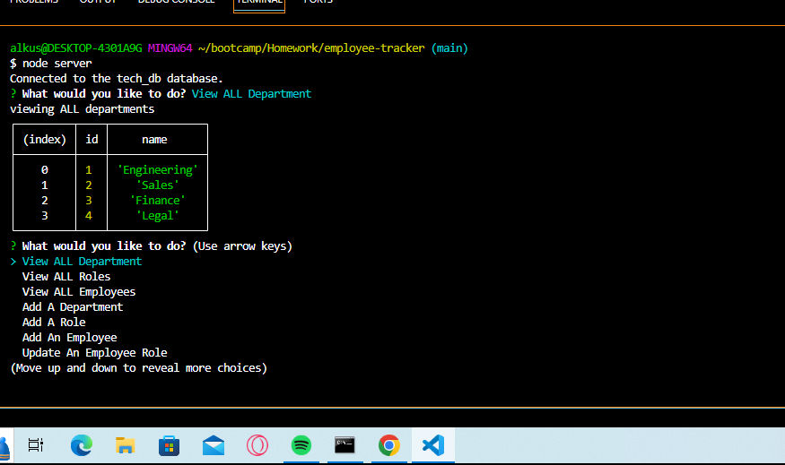
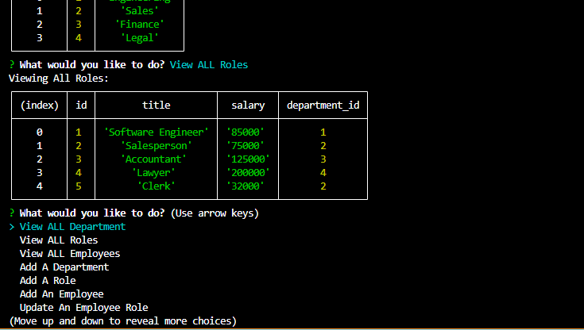
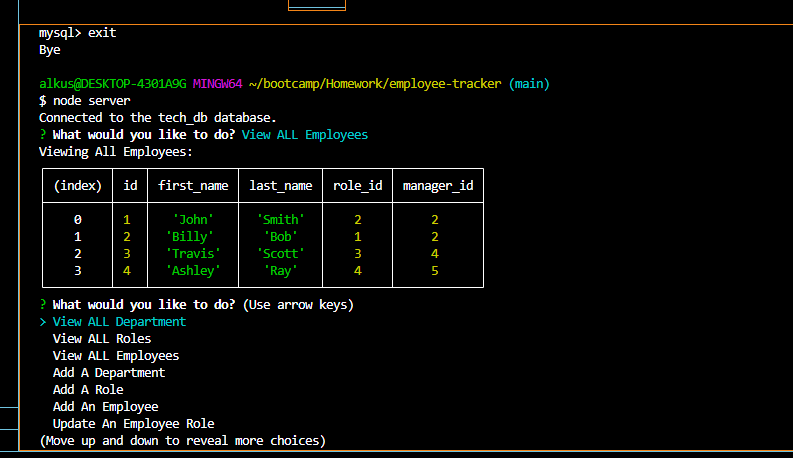

# employee-tracker

## Description
This is a terminal based application created to make it easy for an employer to manage departments, roles, and employees. 

## Instalation
Will need node, inquirer, and mysql for this application. run npm i to install inquirer and mysql2.

## Usage
Run npm i to download necessary imports. Then node server in the console to boot up the application.

## License
MIT License